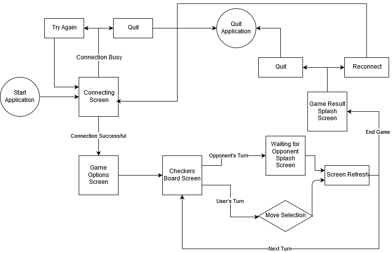
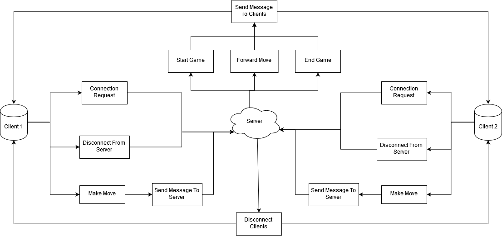

# Requirements Specification for CS451-002 Group 3 Project
*Revision 1.0*

| | |
| --- | --- |
| **Group Members** | Korede Aderele   Natie Bohnel   Samara Painter   Alex Veltchev |
| **Faculty Advisor** | Dr. Filippos Vokolos, Ph. D |
| | |

## Revision History

| **Name** | **Date** | **Reason for Change** | **Revision** |
| --- | --- | --- | --- |
| Samara Painter | 1/16/2019 | Initial Document Creation - Empty Sections with Section Headers | 0.9 |
| Samara Painter | 1/23/2019 | First Draft of All Sections Minus Priorities, Use Cases, and Glossary | 0.91 |
| Natie Bohnel | 1/23/2019 | Document Revision & Adding Sections | 0.92 |
| Samara Painter | 1/26/2019 | Document Revision, Completed Priorities and Diagrams | 1.0 |

## Table of Contents

1. [Introduction](#introduction)
   1. [Purpose of Document](#purpose-of-document)
   2. [Scope of Document](#scope-of-document)
   3. [Overview of Document](#overview-of-document)
2. [Description](#description)
   1. [Product Perspective](#product-perspective)
      1. [Server Role](#server-role)
      2. [Client Role](#client-role) 
   2. [Product Functions](#product-functions)
      1. [Client Functionality](#client-functionality)
      2. [Server Functionality](#server-functionality)
   3. [User Description](#user-description)
   4. [Assumptions and Dependencies](#assumptions-and-dependencies)
      1. [Externally Hosted Server](#externally-hosted-server)
   5. [Requirements Apportioning](#requirements-apportioning)
3. [Functional Requirements](#functional-requirements)
   1. [Server](#server)
      1. [Communication](#communication)
      2. [Messages](#messages)
   2. [Client](#client) 
      1. [Interactions](#interactions)
      2. [Internal Game State](#internal-game-state) 
4. [Non-Functional Requirements](#non-functional-requirements)
   1. [Message Types](#message-types)
      1. [Common](#common)
      2. [Game State Message](#game-state-message)
      3. [Game Start Message](#game-start-message)
      4. [Game Move Message](#game-move-message)
      5. [Opposing Player Disconnected Message](#opposing-user-disconnected-message)
   2. [Performance](#performance)
   3. [Hardware](#hardware)
   4. [Accessibility](#accessibility)
5. [User Interface](#user-interface)
   1. [Connecting Screen](#connecting-screen)
   2. [Game Options Screen](#game-options-screen)
   3. [Checkers Board Screen](#checkers-board-screen)
   4. [Waiting for Opponent Splash Screen](#waiting-for-opponent-splash-screen)
   5. [Game Result Splash Screen](#game-result-splash-screen)  
6. [Use Cases](#use-cases)
   1. [Use Case Flow](#use-case-flow)
   2. [Activity Diagram](#activity-diagram)
7. [Glossary](#glossary)   

## 1. Introduction
### 1.1 Purpose of Document

This document will provide the requirements specifications for the CS451-002 Group 3 Project. 
It will also serve as a reference for the developers to design, implement, and test the project
for both completeness and correctness.

### 1.2 Scope of Document

This document will specify in detail all functions the project must perform to be considered both complete and correct. 
These specifications will be detailed enough for developers to translate into code with no ambiguity.

### 1.3 Overview of Document

This document will specify the functional, non-functional, and user interface requirements for the CS451-002
Group 3 Project. It will also specify desired use cases and informative diagrams. The backend and frontend of the project
will run separately, and will be referred to as **server** and **client**, respectively. The requirements will
be provided for both the server backend and client frontend.

## 2. Description

### 2.1 Product Perspective

The CS451-002 Group 3 Project is an environment that allows two remote users to play a game of checkers
against each other in real time. The gameplay rules enforced by the environment can be found [here](http://www.usacheckers.com).
The project is intended to be run via three separate computers: a server, and two clients. 

#### 2.1.1 Server Role

The server will primarily facilitate the connection between two clients connected to the server, and will not be directly interacted
with by the users. Gameplay moves made on one client will be sent to the server, which will forward them to the other client. The
server will also start and end games between two clients connected to the server.

#### 2.1.2 Client Role

The client will connect to the server, and will provide a graphical user interface (GUI) to the users with which to play a game of
checkers. The GUI will represent an interactable checkers board and checkers pieces. When it is a user's turn, they will utilize the GUI
to make a legal checkers move that will be sent to the other user. Each client will update its own GUI when directed to by the server
that reflects the last move that was made.

### 2.2 Product Functions

#### 2.2.1 Server Functionality

The server will have the following functionality:

+ Ability to host one game over the Wi-Fi network between two clients
+ Ability to be connected to by two clients at a time
+ Ability to start a game between two connected clients
+ Ability to receive moves made by a connected client
+ Ability to send moves made by one client to the other connected client
+ Ability to end a game between two connected clients
+ Ability to disconnect clients
+ Ability to start a new game between two connected clients once a game has ended

#### 2.2.2 Client Functionality

The client will have the following functionality:

+ Ability to connect to the server
+ Ability to display a graphical user interface (GUI) representing a checkers board
+ Allows the user to select a legal checkers move
+ Ability to send a user's selected move to the server
+ Ability to receive a user's selected move from the server
+ Ability to refresh the GUI display to reflect a move received from the server

### 2.3 User Description

The ideal user for the CS451-002 Group 3 Project would be two friends with a general
familiarity of computers who desire to play a game of checkers in two separate locations.

### 2.4 Assumptions and Dependencies

#### 2.4.1 Externally Hosted Server

This project will be dependent on an external host on which to run the server. The specific external
host that will be utilized will be determined in the design phase of the project. If the external host
goes down or otherwise ceases to function, the project will not be able to be run. In this case,
the project timeline will be modified to account for a redesign that includes a different external
host and a migration of the server application to the new external host.

### 2.5 Requirements Apportioning

| Priority Level | Description |
| --- | --- |
| **1** | **Priority 1** requirements are essential to the project and must be in the final build. These requirements must be tested and verified to ensure proper functionality. |
| **2** | **Priority 2** requirements are not required for the final build, but will be included if there is sufficient time. The project will be designed to easily incorporate these requirements at a later time, but will also function without them present. |
| **3** | **Priority 3** requirements are not required for the final build and will not be considered in the design of the project. These requirements will reflect the ideal functionality of the project given enough time and resources. |

## 3. Functional Requirements

### 3.1 Server

#### 3.1.1 Communication
+ **R3.1.1.1** Receives connection requests from clients. *Priority 1*
  + **R3.1.1.1.1** Can deny connection requests. *Priority 1*
+ **R3.1.1.2** Creates and maintains separate two-way lines of communication with the clients. *Priority 1*
  + **R3.1.1.2.1** Connects to only two separate clients at once. *Priority 1*
  + **R3.1.1.2.2** Lines of communication happen via a network connection. *Priority 1*
+ **R3.1.1.3** Receives messages from connected clients. *Priority 1*
+ **R3.1.1.4** Sends messages to connected clients. *Priority 1*
  + **R3.1.1.4.1** "Game Move" and "Game State" messages received from a connected client will be forwarded to the other connected client. *Priority 1*
+ **R3.1.1.5** Can disconnect clients. *Priority 1*
  + **R3.1.1.5.1** If a connected client disconnects from the server, sends the other connected client an "Opposing Player Disconnected" message. *Priority 2*

#### 3.1.2 Messages
+ **R3.1.2.1** Reads the header of every message. *Priority 1*
+ **R3.1.2.2** Reads the body of every "Game State" message. *Priority 1*
  + **R3.1.2.2.1** If a "Game State" message stating the conclusion of the game is received:
    + **R3.1.2.2.1.1** Forwards the messages received from one connected client to the other connected client, then *Priority 2*
    + **R3.1.2.2.1.2** Disconnects both clients. *Priority 1*
  + **R3.1.2.2.2** If a "Game State" message stating the game is continuing is received, forwards all messages received from one connected client to the other connected client. *Priority 1*
+ **R3.1.2.3** Constructs and sends "Opposing Player Disconnected" messages. *Priority 2*
  + **R3.1.2.3.1** After sending the "Opposing Player Disconnected" message, disconnects from the remaining connected client. *Priority 2*
+ **R3.1.2.4** Constructs and sends "Game Start" messages. *Priority 1*
  + **R3.1.2.4.1** Color assignments of the connected clients contained in the "Game Start" messages are randomly determined. *Priority 2*
  + **R3.1.2.4.2** Each connected client must be assigned a different color. *Priority 1*

### 3.2 Client

#### 3.2.1 Interactions

+ **R3.2.1.1** Attempts to connect to the server upon opening. *Priority 1*
  + **R3.2.1.1.1** Receives messages from the server. *Priority 1*
    + **R3.2.1.1.1.1** Upon receiving a "Game Start" message, loads the initial game state. *Priority 1*
    + **R3.2.1.1.1.2** Upon receiving a "Game Move" message, refreshes internal board state. *Priority 1*
    + **R3.2.1.1.1.3** Upon receiving a "Game State" message with a state indicating the conclusion of the game has been reached, displays the "Game Result Splash Screen" via the graphical user interface (GUI). *Priority 2*
    + **R3.2.1.1.1.4** Upon receiving an "Opposing Player Disconnected" message, displays the "Game Result Splash Screen" via the GUI. *Priority 2*
  + **R3.2.1.1.2** Sends "Game State" and "Game Move" messages to the server. *Priority 1*
+ **R3.2.1.2** Displays GUI to the user. *Priority 1*
+ **R3.2.1.3** Can create and read "Game State" messages. *Priority 1*
+ **R3.2.1.4** Can create and read "Game Move" messages. *Priority 1*
  + **R3.2.1.4.1** "Game Move" messages created reflect move choices made by the user via the GUI. *Priority 1*
+ **R3.2.1.5** Can read "Opposing Player Disconnected" messages. *Priority 2*
+ **R3.2.1.6** Can read "Game Start" messages. *Priority 1*

#### 3.2.2 Internal Game State

+ **R3.2.2.1** Stores the board state of a game of checkers. *Priority 1*
+ **R3.2.2.2** Initializes a game of checkers, including creating a board state, when given a color assignment. *Priority 1*
+ **R3.2.2.3** Validates legal gameplay moves. *Priority 1*
  + **R3.2.2.3.1** Calculates all pieces that are able to be moved in a given board state. *Priority 1*
  + **R3.2.2.3.2** Calculates all movement paths a piece can make in a given board state. *Priority 1*
  + **R3.2.2.3.3** Calculates the number of friendly and enemy pieces captured in a given board state. *Priority 1*
  + **R3.2.2.3.4** Calculates board state conditions indicative of:
    + **R3.2.2.3.4.1** Continue. *Priority 1*
    + **R3.2.2.3.4.2** Draw. *Priority 3*
    + **R3.2.2.3.4.3** Winning, when the game has reached a conclusion. *Priority 1*
    + **R3.2.2.3.4.4** Losing, when the game has reached a conclusion. *Priority 1*
+ **R3.2.2.4** Only allows the user to make gameplay moves validated as legal. *Priority 1*
+ **R3.2.2.5** Calculates an updated board state given a move. *Priority 1*
+ **R3.2.2.6** Reflects the current board state in the graphical user interface. *Priority 1*

## 4. Non-Functional Requirements

### 4.1 Message Types

#### 4.1.1 Common

+ **R4.1.1.1** Both the client and the server agree on a specific shared message format. *Priority 1*
  + **R4.1.1.1.1** All message types follow the same specific message format. *Priority 1*
+ **R4.1.1.2** Messages have a header, which contain: *Priority 2*
  + **R4.1.1.2.1** An ID indicating what message type the message is. *Priority 1*
+ **R4.1.1.3** Messages have a body, which contain the information that is being sent. *Priority 1*
+ **R4.1.1.4** All messages are created by the client, apart from the "Opposing Player Disconnected" and "Game Start" messages, which are created by the server. *Priority 1*

#### 4.1.2 Game State Message

+ **R4.1.2.1** The body of a "Game State" message contains an indicator of the current game state, with the following options:
  + **R4.1.2.1.1** Continue, meaning it is the other connected client's turn to move. *Priority 1*
  + **R4.1.2.1.2** Draw, meaning it is the end of the game and neither client wins. *Priority 3*
  + **R4.1.2.1.3** Forfeit, meaning it is the end of the game, and one of the clients has conceded. *Priority 1*
  + **R4.1.2.1.4** End, meaning it is the end of the game, with one client winning and one client losing. *Priority 1*

#### 4.1.3 Game Start Message

+ **R4.1.3.1** The body of the "Game Start" message contains a color assignment for the client it is sent to. *Priority 1*
  + **R4.1.3.1.1** The color assignment is either "Red" or "Black". *Priority 1*

#### 4.1.4 Game Move Message

+ **R4.1.4.1** The body of a "Game Move" message contains enough information for a client to construct the new board state given the next game move. *Priority 1*

#### 4.1.5 Opposing Player Disconnected Message

+ **R4.1.5.1** The "Opposing Player Disconnected" message does not have a body. *Priority 2*

### 4.2 Performance

+ **R4.2.1** The messages sent from one connected client are forwarded to the other connected client by the server in a time of < 5 seconds, provided the Internet connection is stable and above a speed of 30MB/s. *Priority 1*
+ **R4.2.2** The client refreshes its display after receiving a message from the server in a time of < 3 seconds. *Priority 2*
+ **R4.2.3** There is no discernable lag between a user interacting with the client GUI and the GUI changing in response. *Priority 1*

### 4.3 Hardware

+ **R4.3.1** The hardware running the server and the hardware running the client must meet the minimum requirements to run Java 8.0 as specified by [Java's Website](https://www.java.com/en/download/help/sysreq.xml).
+ **R4.3.2** The hardware running the server must have:
  + **R4.3.2.1** Internet access *Priority 1*
  + **R4.3.2.2** An additional 128MB in memory to store the program *Priority 1*
+ **R4.3.3** The hardware running the client must have:
  + **R4.3.3.1** Internet access
  + **R4.3.3.2** An additional 128MB in memory to store the program
  + **R4.3.3.3** Graphics capabilities
  + **R4.3.3.4** Screen display
  + **R4.3.3.5** Mouse

### 4.4 Accessibility

+ **R4.4.1** The server is running at all times on an external host, unless it is stopped for maintenance. *Priority 3*
  + **R4.4.1.1** In the event the server is stopped for maintenance, it will be back up in under an hour, or: *Priority 3*
  + **R4.4.1.2** A message updating users on the state of the server and maintenance will be posted on the project website every hour until maintenance is complete. *Priority 3*
+ **R4.4.2** The client application is available for free download on the project website. *Priority 1*
+ **R4.4.3** The project website is available to the public. *Priority 1*

## 5. User Interface

**Figure 1.** *The flowchart for navigating the GUI on the client.*

The client will provide a graphical user interface (GUI) to the user. *Figure 1* shows the flow in navigating the different screens
displayed by the GUI. The requirements for each screen are outlined below.

### 5.1 Connecting Screen

+ **R5.1.1**  The Connecting Screen is the first screen displayed to the user upon starting the client application. *Priority 1*
+ **R5.1.2**  The Connecting Screen displays the current connection status as "Connecting", "Connected", or "Unable to Connect." *Priority 1*
  + **R5.1.2.1** If the connection status is "Unable to Connect," a reason is displayed as "Server Not Found" or "Game in Progress." *Priority 2*
  + **R5.1.2.2** If the connection status is "Unable to Connect," two buttons are displayed: *Priority 2*
    + **R5.1.2.2.1** A "Try Again" button, when clicked, attempts to connect to the server again. *Priority 2*
    + **R5.1.2.2.2** A "Quit" button, when clicked, closes the client application. *Priority 2*
  + **R5.1.2.3** If the connection status is "Connected," the connecting screen remains displayed for an additional 3 seconds to allow the user enough time to read the status. *Priority 1*
    + **R5.1.2.3.1** After the 3 second pause of the connection screen with a "Connected" status, the GUI will display the Game Options Screen. *Priority 1*

### 5.2 Game Options Screen

+ **R5.2.1** The Game Options Screen contains a text input box with the prompt "Nickname". *Priority 2*
  + **R5.2.1.1** The input of the text input box is limited to uppercase letters, lowercase letters, and spaces. *Priority 2*
    + **R5.2.1.1.1** If an invalid character is entered by the user, an error message will display "Invalid nickname entered. Must contain only letters and spaces." *Priority 2*
    + **R5.2.1.1.2** If an invalid character is present in the text input box, the "Start Game" button (R5.2.2) will not be clickable. *Priority 2*
  + **R5.2.1.2** The text input box is limited to 32 characters. *Priority 2*
+ **R5.2.2** The Game Options Screen contains a "Start Game" button, when clicked, the GUI displays the Checkers Board Screen. *Priority 1*

### 5.3 Checkers Board Screen

+ **R5.3.1** The Checkers Board Screen contains an 8x8 board of square tiles in alternating colors. *Priority 1*
  + **R5.3.1.1** The alternating colors are neither red nor black. *Priority 1*
+ **R5.3.2** The Checkers Board Screen displays no more than 12 red circular game pieces and 12 black circular game pieces. *Priority 1*
  + **R5.3.2.1** When it is the user's turn, the user's pieces that can move flash yellow and become clickable. *Priority 2*
    + **R5.3.2.1.1** When a piece is clicked by the user, all of the tiles that piece can legally move to flash yellow and become clickable. *Priority 1*
      + **R5.3.2.1.1.1** The yellow flashing is defined as a fade-to-yellow and fade-from-yellow cycle which takes approximately 3 seconds. *Priority 1*
      + **R5.3.2.1.1.2** The yellow flashing is continuously looped until a move is made or the piece is deselected (R5.3.2.1.3). *Priority 1*
    + **R5.3.2.1.2** When a flashing tile is clicked, the clicked piece is moved to that tile. *Priority 1*
      + **R5.3.2.1.2.1** If any opponent pieces were jumped in the move, they are removed from the board and noted in the "Pieces Captured" box. *Priority 1*
      + **R5.3.2.1.2.2** After the user has selected a move, the user's pieces are no longer clickable. *Priority 1*
      + **R5.3.2.1.2.3** After the user has selected a move, the GUI displays a splash screen after 3 seconds: *Priority 1*
        + **R5.3.2.1.2.3.1** If the move caused an end game state, the Game Result Splash Screen is displayed. *Priority 2*
        + **R5.3.2.1.2.3.2** If the move did not cause an end game state, the Waiting for Opponent Splash Screen is displayed. *Priority 1*
      + **R5.3.2.1.2.4** When a piece is moved, a quick animation is displayed that shows the move's path. *Priority 3*
    + **R5.3.2.1.3** When a piece is clicked a second time by the user, the piece is deselected. *Priority 1*
+ **R5.3.3** The Checkers Board Screen contains a "Pieces Captured" box that contains a running total of the number of opponent pieces the user has captured. *Priority 2*
  + **R5.3.3.1** The displayed running total must not be below 0 or above 12. *Priority 2*
+ **R5.3.4** The Checkers Board Screen contains a "Forfeit" button, when clicked, the GUI displays the Game Result Splash Screen with the "Forfeit" status. *Priority 2*

### 5.4 Waiting for Opponent Splash Screen

+ **R5.4.1** The Waiting for Opponent Splash Screen displays as an overlay on top of the Checkers Board Screen. *Priority 2*
  + **R5.4.1.1** The splash screen is displayed at 50% opacity. *Priority 2*
+ **R5.4.2** The Waiting for Opponent Splash Screen displays the message "Waiting for Opponent." *Priority 2*
+ **R5.4.3** The Waiting for Opponent Splash Screen is automatically removed at the start of the user's next turn or when the Game Result Splash Screen is displayed. *Priority 1*

### 5.5 Game Result Splash Screen

+ **R5.5.1** The Game Result Splash Screen displays as an overlay on top of the Checkers Board Screen. *Priority 2*
  + **R5.5.1.1** The splash screen is displayed at 50% opacity. *Priority 2*
+ **R5.5.2** The Game Result Splash Screen displays the status of the game as "Winner," "Loser," "Forfeit," or "Draw." *Priority 1*
+ **R5.5.3** The Game Result Splash Screen contains a "Quit" button, when clicked, exits the client application. *Priority 2*
+ **R5.5.4** The Game Result Splash Screen contains a "Reconnect" button, when clicked, attempts to reconnect to the server for another game. *Priority 2*

## 6. Use Cases

### 6.1 Use Case Flow

**6.1.1 Starting the Game**
Users start the client which will attempt to connect to the server.

+ **Precondition:** Less than 2 users are currently connected to the server.
+ **Action:** A user launches the client
+ **Postcondition:** A user connects to the server. If another user is present, the game begins. If not, the first user will wait for another to join.

**6.1.2 Selecting a Piece to Move** 
Users can select a valid piece to move on their turn using the mouse.

+ **Precondition:** The user has at least one valid piece which they can move. Valid pieces will be highlighted by the interface.
+ **Action:** The user selects a valid piece.
+ **Postcondition:** The user may select a valid space for that piece to move.

**6.1.3 Moving a Selected Piece**
Once a piece is selected, the user can select a valid space to move it to using the mouse.

+ **Precondition:** The user has selected a valid piece to move. Spaces which the selected piece can move to will be highlighted by the interface.
+ **Action:** The user selects a valid space to move the selected piece to.
+ **Postcondition:** The piece moves to the new space and the user ends their turn.

**6.1.4 Capturing a Piece**
The object of checkers is to capture all of an opponent's pieces. On a user's turn, if they have any move which captures an opponent's piece, they must make a move which captures a piece.

+ **Precondition:** The user is adjacent to an opposing piece and the space behind that opposing piece is available to jump to.
+ **Action:** The user jumps to the open space and captures the opposing piece.
+ **Postcondition:** The opposing piece is removed from play, the user's capture count increases by one, the piece moves to the empty space, and the user ends their turn.

**6.1.5 Kinging a Piece**
Over the course of a game, pieces can be Kinged, which allows them to hop backwards as well as forwards.

+ **Precondition:** The user moves a piece to the row of the board furthest from their starting side. At least one of the user's pieces has previously been captured and not already used for a King.
+ **Action:** The moved piece becomes a King.
+ **Postcondition:** The King piece now can move in 4 directions rather than 2.

**6.1.6 Winning the Game**
Most games of checkers will end when one user wins the game.

+ **Precondition:** The user is playing a game.
+ **Action:** The user captures all of their opponent's pieces.
+ **Postcondition:** That user wins the game. Victory and defeat messages are appropriately displayed on both clients before they are disconnected from the server.

**6.1.7 Losing the Game**
Occasionally, a game of checkers cannot be won. In this circumstance, a loser is determined.

+ **Precondition:** It is the user's turn.
+ **Action:** The user has no valid moves which they can make.
+ **Postcondition:** That user loses the game. Victory and defeat messages are appropriately displayed on both clients before they are disconnected from the server.

**6.1.8 Starting a Rematch**
Because the server only supports 2 users playing at a time, those users are disconnected upon the end of the game to allow other users to play. The Reconnect button allows users to requeue for another game after a game is completed.

+ **Precondition:** Two users have finished playing a game and have been disconnected from the server.
+ **Action:** The user clicks the Reconnect button.
+ **Postcondition:** The client attempts to reconnect to the server for another game.

**6.1.9 Quitting the Game**
At any point, a player can choose to end the game. If they do, they forfeit the game to their opponent.

+ **Precondition:** The user is playing a game
+ **Action:** The user quits through the game interface.
+ **Postcondition:** That user loses the game. Victory and defeat messages are appropriately displayed on both clients before they are disconnected from the server.

### 6.2 Activity Diagram

**Figure 2.** *The Activity Diagram for the use cases.*

## 7. Glossary

+ **Connected Client** - A client currently connected via two-way communication to the running server
+ **King** - A special piece with which a regular piece is replaced when it reaches the side of the board closest to the opponent. Kings can both move and capture in the forward and backward diagonal direction.
+ **Kinging** - The action of ascending a regular piece to a King.
+ **Legal Gameplay Moves** - All legal moves in a game of Checkers as determined by [USACheckers](http://www.usacheckers.com).